# 功能演示

这些是 2026-09-17 的实际使用截图，展示当时的界面与操作状态。截图中的项目、知识条目和范本库没有随仓库提供；全新安装不会自动出现图中的数据。可使用 [公开演示文本](../examples/README.md)建立自己的样例。

推荐阅读顺序：范本与知识管理 → 原稿分析与人工确认 → 提示词配置。点击图片可查看原图。

## 范本与知识管理

### 1. 选择创作入口

首页提供继续已有小说、开始新小说和独立查询范本三个入口。

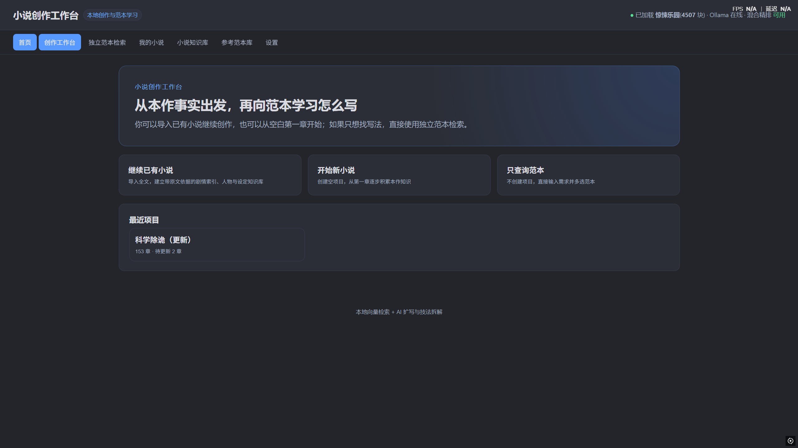

### 2. 管理参考范本

导入 TXT / EPUB，并选择参与检索的范本。图中书名仅为本地使用状态，仓库不提供这些作品或索引。

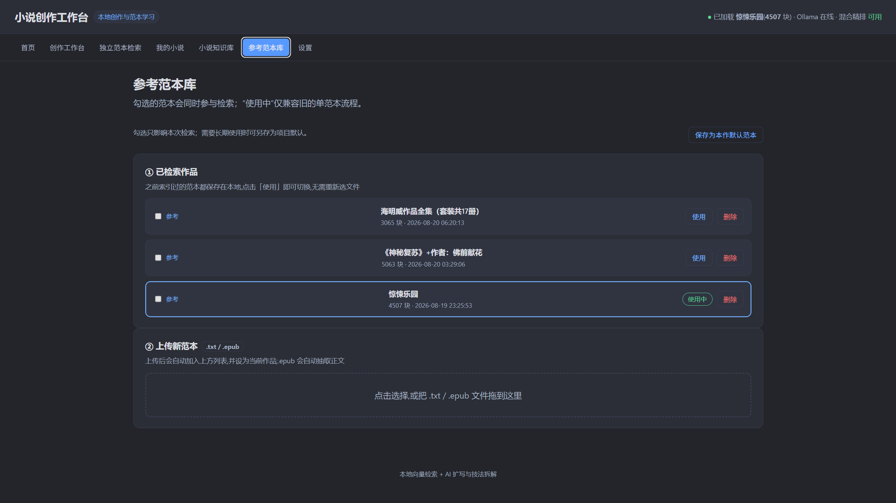

### 3. 按章节建立知识库

选择章节范围和建立方式；可查看待更新章节、更新向量索引及 AI 运行记录。

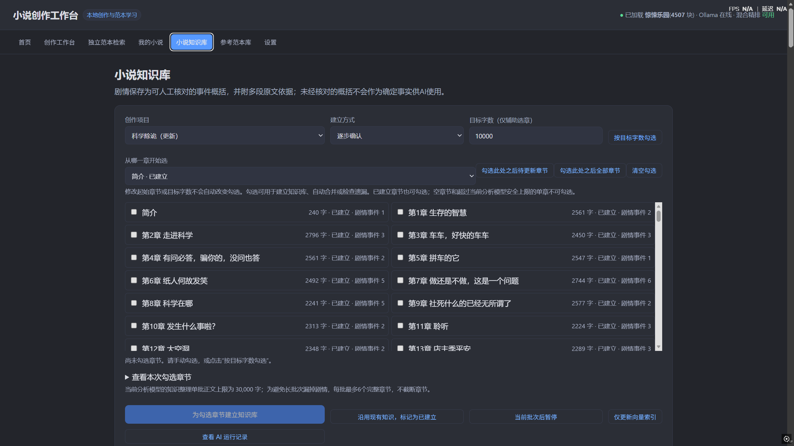

### 4. 浏览结构化知识卡片

人物、关系与名词等条目以卡片展示，带有确认状态、来源章节数和关联入口。

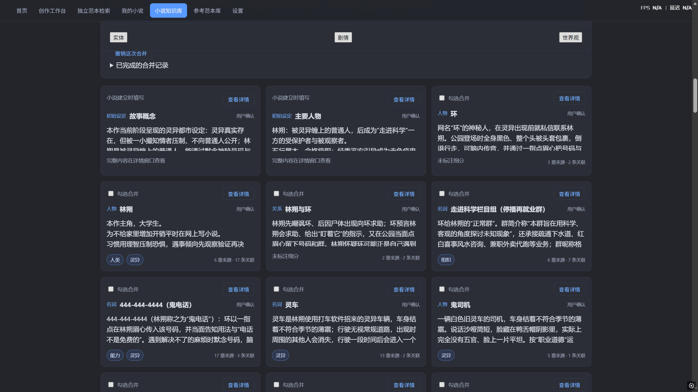

### 5. 用关系画布整理知识

按剧情分段浏览人物、名词和场景，查看卡片之间的有向关系。图中为实际使用时打开右键菜单的状态。

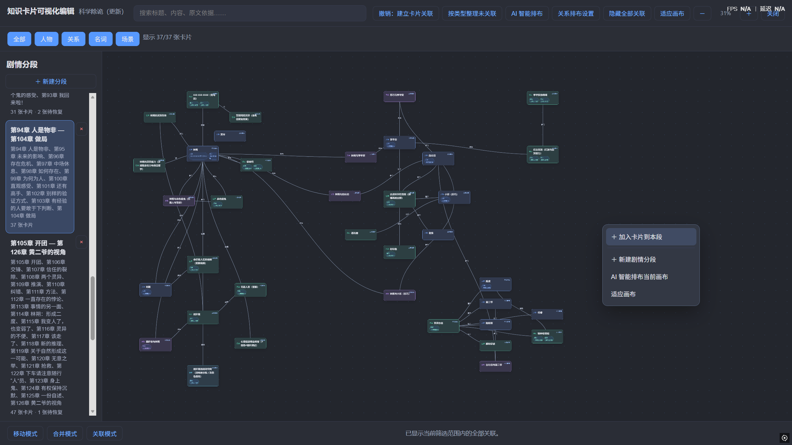

### 6. 人工核对剧情事件

剧情概括支持编辑与确认，原文依据可展开查看，并可关联伏笔。

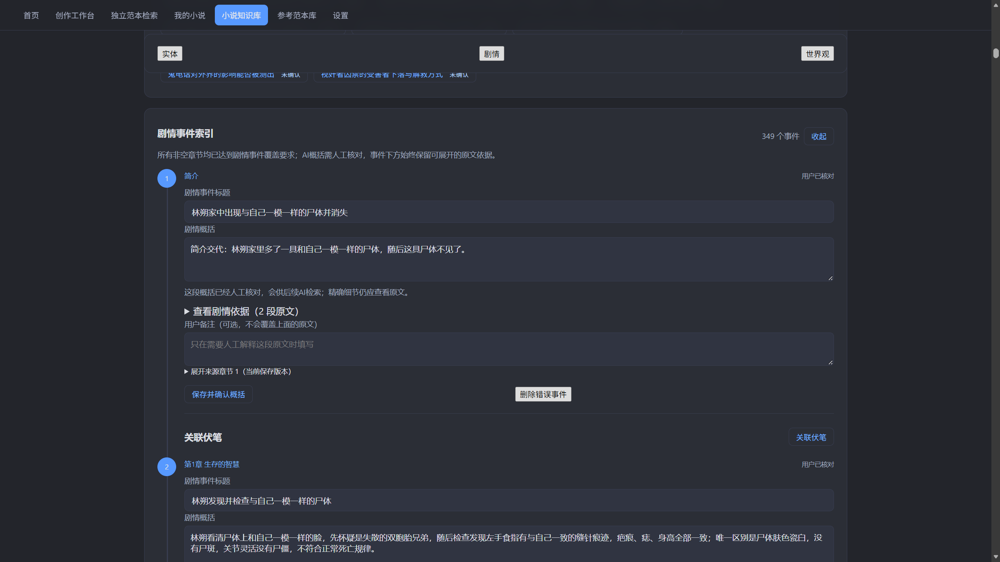

### 7. 审阅伏笔进展

展示待确认的伏笔进展及依据，由用户选择审阅确认或忽略。

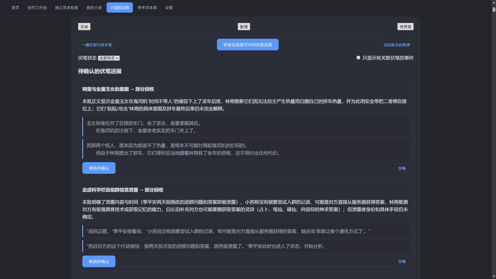

## 原稿分析与人工确认

### 8. 输入原稿与创作目标

工作台展示本作相关依据，用户补充希望加强的描写并提交原稿。

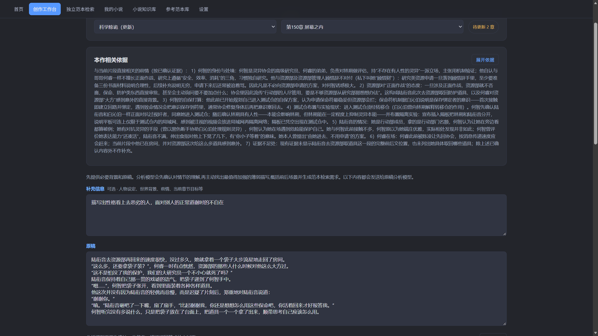

### 9. 先澄清作者意图

模型提出关于性格、表现强度、视角与留白的具体问题，用户可以回答或纠正理解。

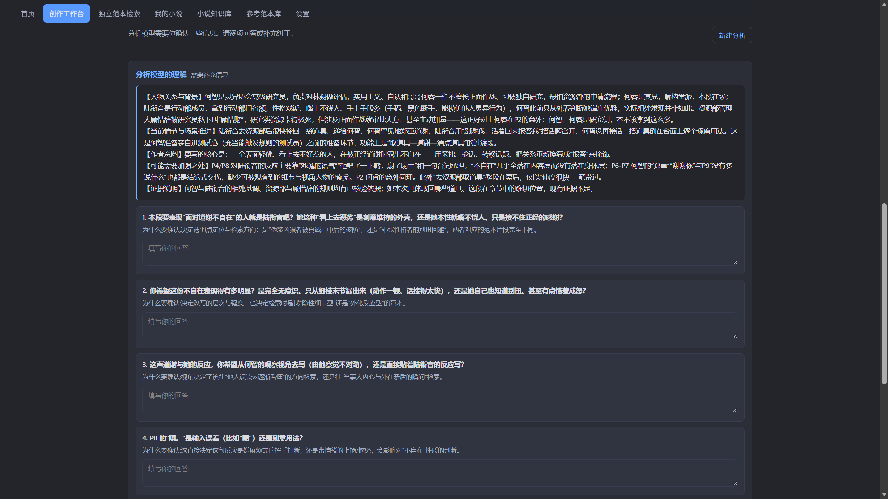

### 10. 确认理解后继续

补充信息后再次展示人物背景、当前场景和作者意图，由用户确认后进入诊断。

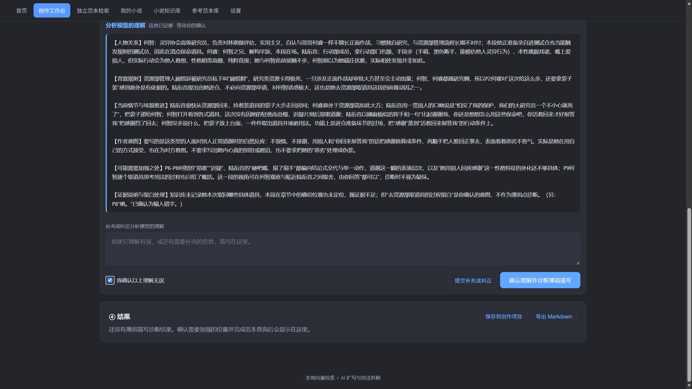

### 11. 定位薄弱描写并准备检索

把原稿定位、薄弱原因、前后场景、丰富目标与检索内容放在一起，支持逐项选择和修改。

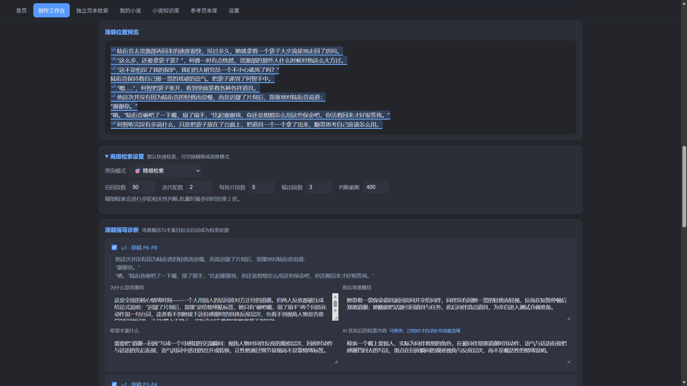

## 提示词配置

### 12. 管理提示词方案

集中查看和保存提示词方案，按用途筛选，并保留可切换的配置。

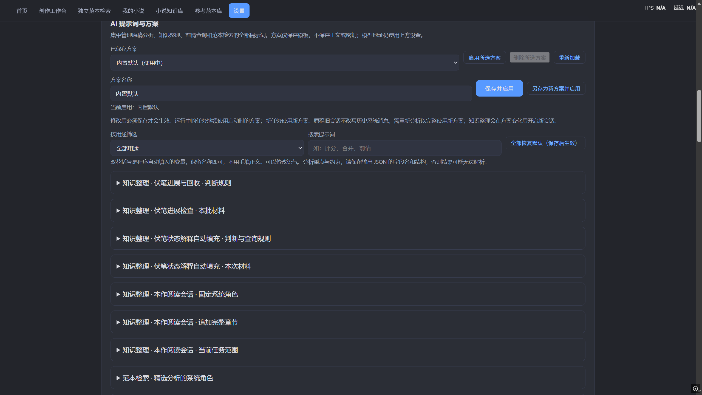

## MCP 客户端查询

### 13. 列出小说、选择项目并调用查询工具

客户端记录展示 `list_novels`、`select_novel`、`search_knowledge_cards` 和 `search_plot_events` 的已完成调用。工具参数与返回值处于折叠状态，因此这张图展示调用流程，不作为每次检索内容准确性的证明。

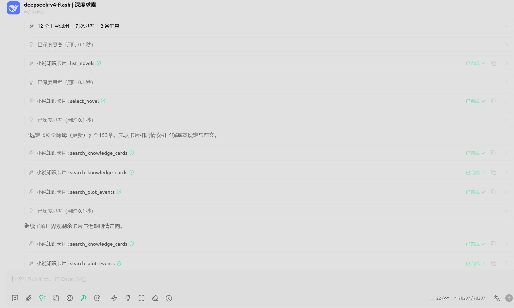

### 14. 根据查询资料整理回答

客户端回答按世界观、人物、主线和待确认伏笔整理资料，并说明最新章节未入库的范围。图中为模型生成的实际回答，内容仍需结合原文人工核对；选择全书不等于读过全书全文。

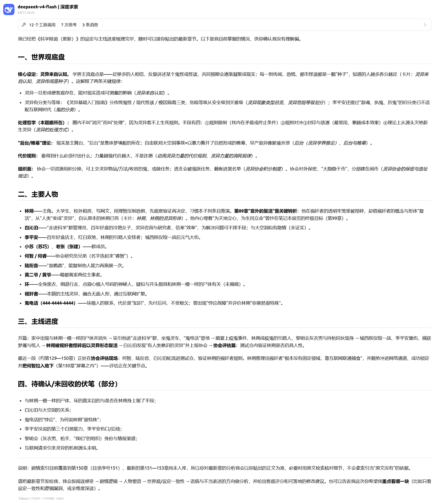

## 演示文本的独立范本检索

### 15. 输入需求并选择检索模式

以仓库中的 [雨夜来信](../examples/雨夜来信.txt)作为参考文本，查询“用反复的小动作表现等待同伴时的焦虑”。图中选择精细检索，页面显示两轮、确认一段、精选一段，并展示来源与高亮片段。

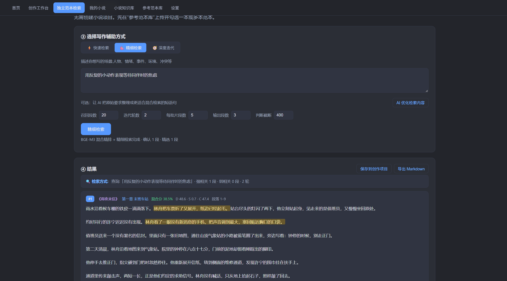

### 16. 查看原文、匹配理由与写法建议

结果高亮折叠车票、查看手机等动作，附有匹配理由、“重复动作外化心理”的技法归纳及迁移建议。这是用户提供的实际运行截图，文本可在公开仓库中核对。短篇样例仅展示操作流程；图中混合分是排序分数，不是准确率，不能据此推断长篇检索质量。

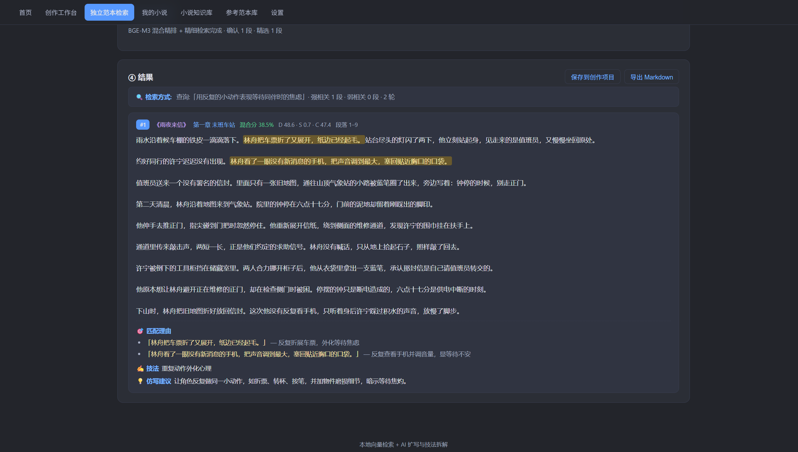
